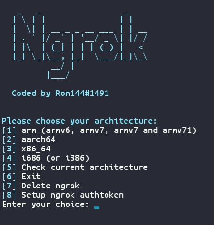

# Installing ngrok with termux & linux

```wget https://raw.githubusercontent.com/revx0012/install-ngrok/main/install.sh && bash install.sh```

# Termux


Linux.. well it's not the same thing as termux so i can't show you...

# having errors?

report it at issues.

# Wiki

if you maybe had a question, you can check out my [Wiki](https://github.com/revx0012/install-ngrok/wiki).
