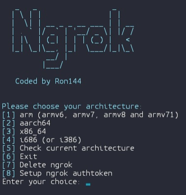

# Installing ngrok with Termux & Linux

```bash
wget https://raw.githubusercontent.com/revx0012/install-ngrok/main/install.sh && bash install.sh
```

Or with curl:

```bash
curl -O https://raw.githubusercontent.com/revx0012/install-ngrok/main/install.sh && bash install.sh
```

# Termux


# Wiki

If you maybe had a question or something, You can check out my [Wiki](https://github.com/revx0012/install-ngrok/wiki).

# Note

Linux, well it's not the same thing as termux so i can't show you.
(you can try the linux if you want though but you must be in linux not termux so you can try it)